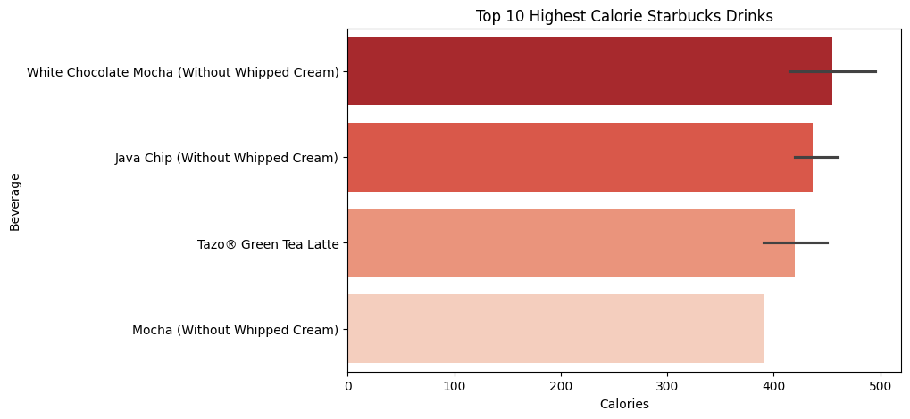
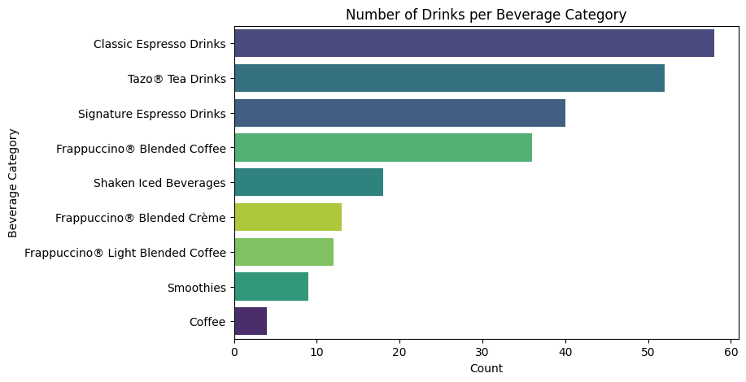
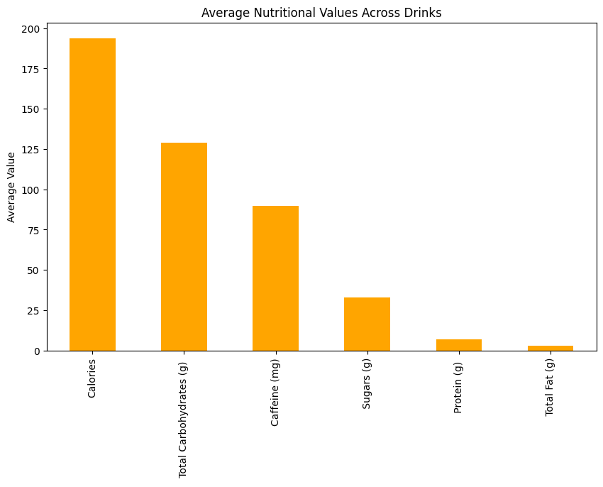
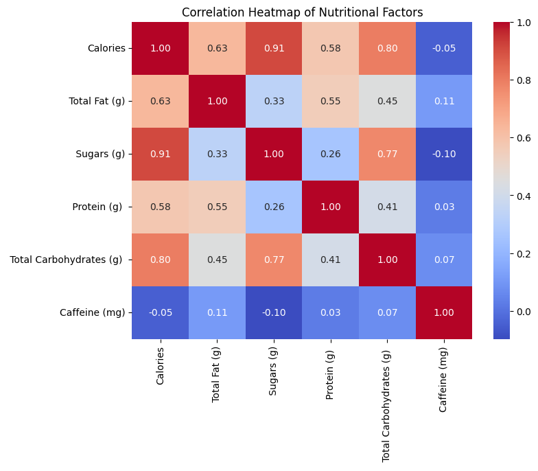
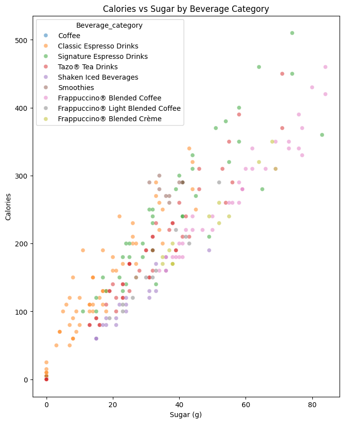

🟢 Starbucks Drinks Data Analysis
📖 Project Overview

This project performs an Exploratory Data Analysis (EDA) on the Starbucks drink dataset.
It explores the nutritional composition of different beverages offered by Starbucks — such as calories, sugar, caffeine, fat, and vitamins — and identifies key insights and correlations.

📂 Dataset Information

File Name: starbucks.csv

Source: Starbucks Nutrition Menu (public dataset)

Rows: Each row represents a unique drink and its nutritional information.

Columns:

Beverage, Beverage_category → Drink name and type

Calories, Total Fat (g), Carbohydrates (g), Sugars (g) → Macronutrient values

Protein (g), Caffeine (mg) → Protein and caffeine content

Vitamin A (% DV), Vitamin C (% DV), Calcium (% DV), Iron (% DV) → Micronutrient daily value percentages

Size → Serving size of the drink

📊 Analysis Performed

Descriptive Statistics

Mean, median, and range of calories, sugar, caffeine, etc.

Identified high/low-calorie drinks.

Category-Wise Analysis

Top beverage categories by count.

Average nutritional values per category.

Correlation Analysis

Relationship between calories, sugar, and fat.

Heatmap to visualize correlations.

Visualizations

Bar charts for category distribution.

Scatter plot (Calories vs Sugar).

Heatmap for correlation matrix.

🧠 Key Insights

Frappuccino beverages generally have the highest sugar and calorie content.

Strong positive correlation between Calories and Sugars (g).

Tea and Espresso drinks are generally lower in calories and caffeine.

Drink size significantly impacts nutritional values.

🛠️ Tech Stack / Tools

Python 🐍

Libraries: pandas, numpy, matplotlib, seaborn, plotly

IDE: Jupyter Notebook / VS Code

📋 Conclusion

This analysis helps visualize the nutritional profile of Starbucks beverages and can guide customers in choosing healthier drink options.
Future enhancements could include:

Predicting calorie levels using machine learning.

Interactive dashboards with Plotly or Power BI.